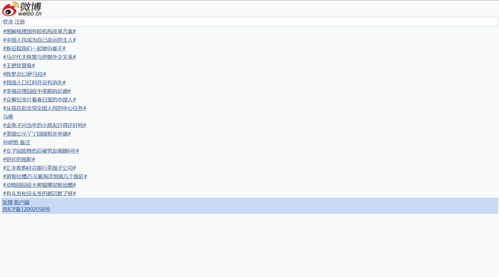
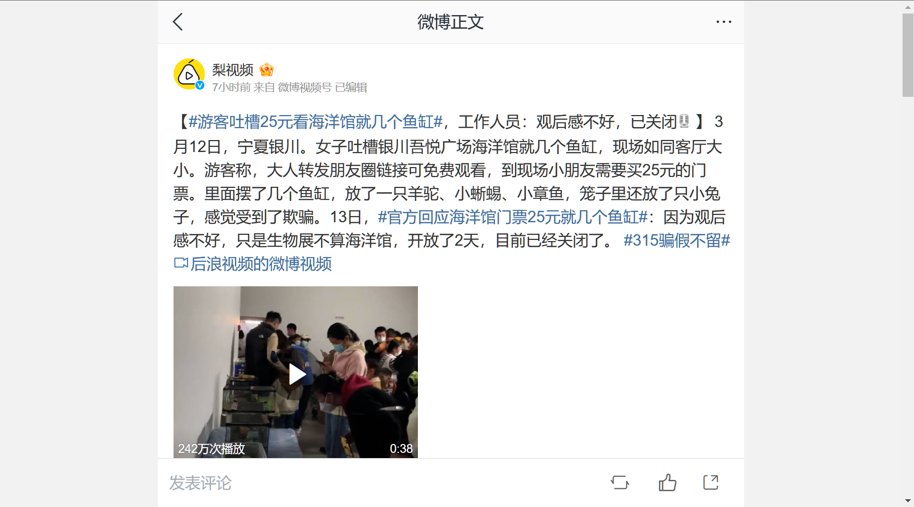
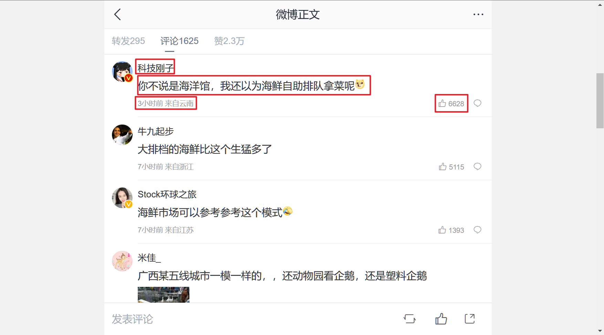

[TOC]

老师提供的需求

## 老师提供的需求

### A级要求(基础分90分)

新应用 (P2P应用，例如:BT、迅雷、skype等)，手机端应用，云平台，大数据搜索

难度较大的应用（加密流量的分类识别）（QQ，SSH，wechat等）

音视频多媒体流量识别

### B级要求(基础分80分)

动态网页的内容识别与控制（论坛、微博、博客、Twitter，Facebook等SNS社交网络等）

### C级要求(基础分70分)

HTTp协议应用（普通Web网站）

垃圾邮件过滤

ftp协议分析系统

### 加分项：

统计功能

界面

数据库

多种编码

。。。酌情增加

减分：功能未实现，未集成(详见后面的要求)

### 系统平台功能要求：

数据捕获技术；常规协议的统计分析；常用明文协议的协议还原，特征及字符串匹配；常规协议控管；数据存储。

### Part1：网络信息数据分类捕获 

A类完成要点:能够捕获到该类型的报文，并能完成简单的统计功能，包括常用端口统计等。

B类完成要点:利用已有工具或者自己编写爬虫工具,获取某一载体信息(博客\论坛\微博\facebook\twitter等任选其一）

C类完成要点：要求提供流量的统计功能、根据协议分类统计功能（包含扩展协议）、端口统计功能，结果展示；提供捕包的峰值性能指标(bps/s)

### Part2：网络协议还原分析

A类完成要点：实现新协议主流软件的特征提取与分析功能，例如BT，可以针对BitTorrent进行分析，提取其协议的特征，并能够从混合流量中识别出不同阶段的流量。

B类完成要点：实现一种信息载体的协议还原，要求能够匹配并识别指定关键字的页面（比如新浪微博，搜索平台等等）

C类完成要点：实现主流应用程序的协议还原，包括Http协议、FTP协议、Telnet协议以及Email协议明文协议等；能够完成典型的编码方式，要求能够识别中文；对*.doc的附件可以进行还原 

### Part3：网络信息内容或报文特征识别 

A类完成要点：采用主流的字符串匹配算法，实现不同阶段协议特征的匹配。

要求：计算各阶段匹配的准确率

B类完成要点：采用主流的字符串匹配算法，匹配其中的主题相关关键词。进行离线的分析，得到主题的统计结果以及舆论的领袖或者热点主题追踪等。

要求：文本识别

C类完成要点：采用主流的字符串匹配算法，选择实现两种模式匹配算法（多模为主），并设计试验对其性能进行比较；将最优的算法应用到系统中，并实现关键字中夹带信息的匹配（包括类似“保***密”的情况）。

要求：文本识别，其他的图片，音视频识别不考虑。

### Part4：网络信息安全管理响应 

A类完成要点：针对前面匹配到的信息，设计并实现有效的控管操作（例如BT包括索引污染、块污染等，造成包含有某关键字的文件下载失败） 

B类完成要点：针对前面匹配到的关键字或者网站地址，设计并实现有效的控管操作，可以采用水军的引导方法，使得某主题被淹没。

C类完成要点：选择典型HTTP应用，针对前面匹配到的网站地址或用户地址，设计并实现有效的控管操作（包括阻断、重定向、DNS欺骗等） 

### Part5：系统辅助功能部分 （ABC类）

完成要点：

数据处理子系统：建立数据存储部分的设计与实现，实现结构化或非结构化的存储，包括原始报文存储，基本表项设计，存储相关结果及日志数据。

界面展示：包括配置、查询功能 

## 最终选择做B类

### B级要求(基础分80分)

动态网页的内容识别与控制（论坛、微博、博客、Twitter，Facebook等SNS社交网络等）

### 系统平台功能要求：

数据捕获技术；（就是抓包）

常规协议的统计分析；

> 常规协议的统计分析是指对网络通信中的常见协议（如HTTP、TCP、UDP等）进行数据采集、处理和分析，以了解网络流量的特征和趋势，并发现网络安全威胁和异常行为。通过对常规协议的统计分析，可以帮助网络管理员更好地了解网络状况、及时发现和应对网络安全威胁。

常用明文协议的协议还原，特征及字符串匹配；（分析数据包中的字节数据，并提取出对应的信息。）

> 常用明文协议的协议还原、特征及字符串匹配是指对常见的明文协议进行分析、还原出协议的结构、特征以及协议中传输的明文字符串，并利用这些信息进行识别、分类和过滤。在这个过程中，可以利用协议头、协议载荷、协议中的固定字符串等信息进行特征提取和字符串匹配。协议还原和字符串匹配是网络流量分析和安全监测的基础工作，可以用于实现恶意流量的检测和防范，网络应用的识别和控制等。

常规协议控管；

> 常规协议控管指针对网络中的常见协议进行管理和控制的一种方式。在网络中，常见的协议如HTTP、FTP、SMTP、POP3、IMAP等，这些协议在应用层中使用明文传输数据，容易被攻击者利用抓包工具获取敏感信息。因此，常规协议控管的主要目的是保护网络中的信息安全。
>
> 常规协议控管通常采用以下几种方式：
>
> 1. 检测和过滤协议数据：对传输的数据进行检测和过滤，防止敏感信息泄露或网络攻击。
> 2. 协议访问控制：对协议的访问进行控制，限制非授权用户的访问，防止数据被篡改或窃取。
> 3. 流量限制和分流：对协议的流量进行限制和分流，防止网络拥堵和DDoS攻击。
>
> 通过常规协议控管，可以有效保护网络中的信息安全，避免因常见协议的漏洞导致的安全问题。

数据存储。（用数据库存储数据）

### 加分项：

- 统计功能

- 界面

- 数据库

- 多种编码

- 。。。酌情增加

- 减分：功能未实现，未集成(详见后面的要求)

### Part1：网络信息数据分类捕获 

B类完成要点:利用已有工具或者自己编写**爬虫**工具,获取某一载体信息(博客\论坛\微博\facebook\twitter等任选其一）

### Part2：网络协议还原分析

B类完成要点：实现一种信息载体的协议还原，要求能够匹配并识别指定关键字的页面（比如新浪微博，搜索平台等等）

### Part3：网络信息内容或报文特征识别 

B类完成要点：采用主流的字符串匹配算法，**匹配**其中的主题相关**关键词**。进行**离线的分析**，得到主题的**统计结果**以及舆论的领袖或者**热点主题**追踪等。

要求：文本识别

### Part4：网络信息安全管理响应 

B类完成要点：针对前面匹配到的关键字或者网站地址，设计并实现有效的控管操作，可以采用水军的引导方法，使得某主题被淹没。（这一步难，叫我写个水军程序出来？？？~~这不是外包给水军公司做的吗？我有这技术不早去开水军公司发财去了？~~）

### Part5：系统辅助功能部分 （ABC类）

完成要点：

数据处理子系统：建立数据存储部分的设计与实现，实现结构化或非结构化的存储，包括原始报文存储，基本表项设计，存储相关结果及日志数据。

界面展示：包括配置、查询功能 

### 预期目标及详细的需求

#### 爬取数据

用爬虫爬微博的近期的热点话题。点进前k个热点话题的页面，爬取前n个帖子的主要内容，和对应帖子的前m个评论，将其存储到数据库中。

##### 实现细节

爬取的网站：https://weibo.cn/pub/

打开是这样的：

点开某个热点话题是这样的：[#游客吐槽25元看海洋馆就几个鱼缸# (weibo.cn)](https://m.weibo.cn/search?containerid=100103type%3D1%26t%3D10%26q%3D%23游客吐槽25元看海洋馆就几个鱼缸%23) ~~话说为毛我电脑端打开会跳转到移动端的网址啊~~

点开第一个帖子（点`全文`按钮），跳转到原始页面：https://m.weibo.cn/status/4878767934407519

如同所示：

下滑界面，可以看到评论：

爬取评论的用户昵称、评论内容、评论时间及ip地址、点赞数，将对应信息存入数据库中，方便之后的分析。

##### 数据库的设计

//TODO

#### 分析数据

